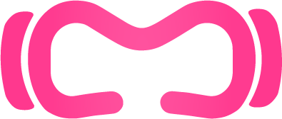
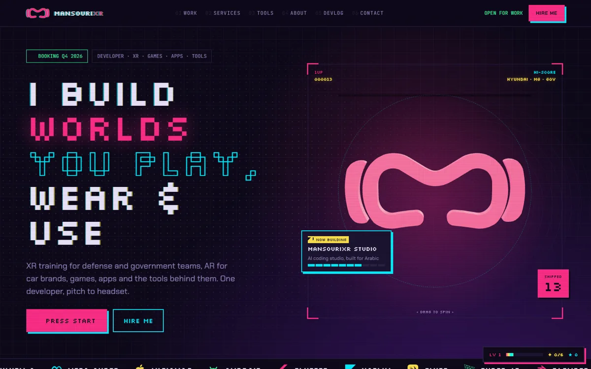
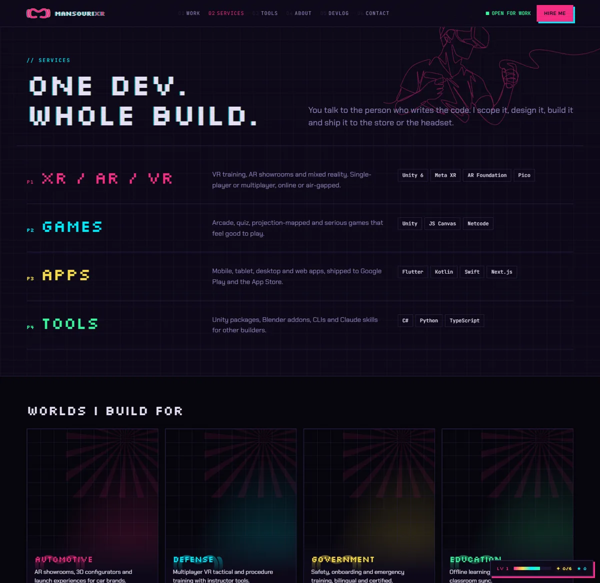
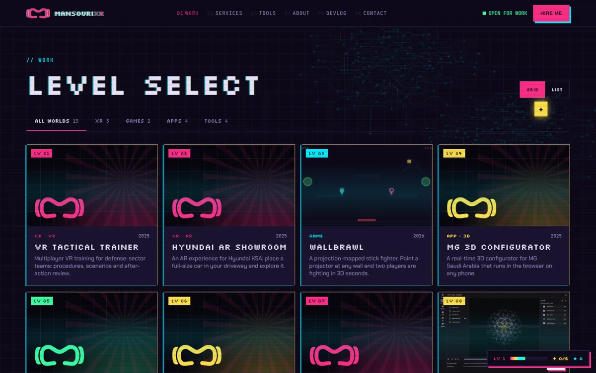
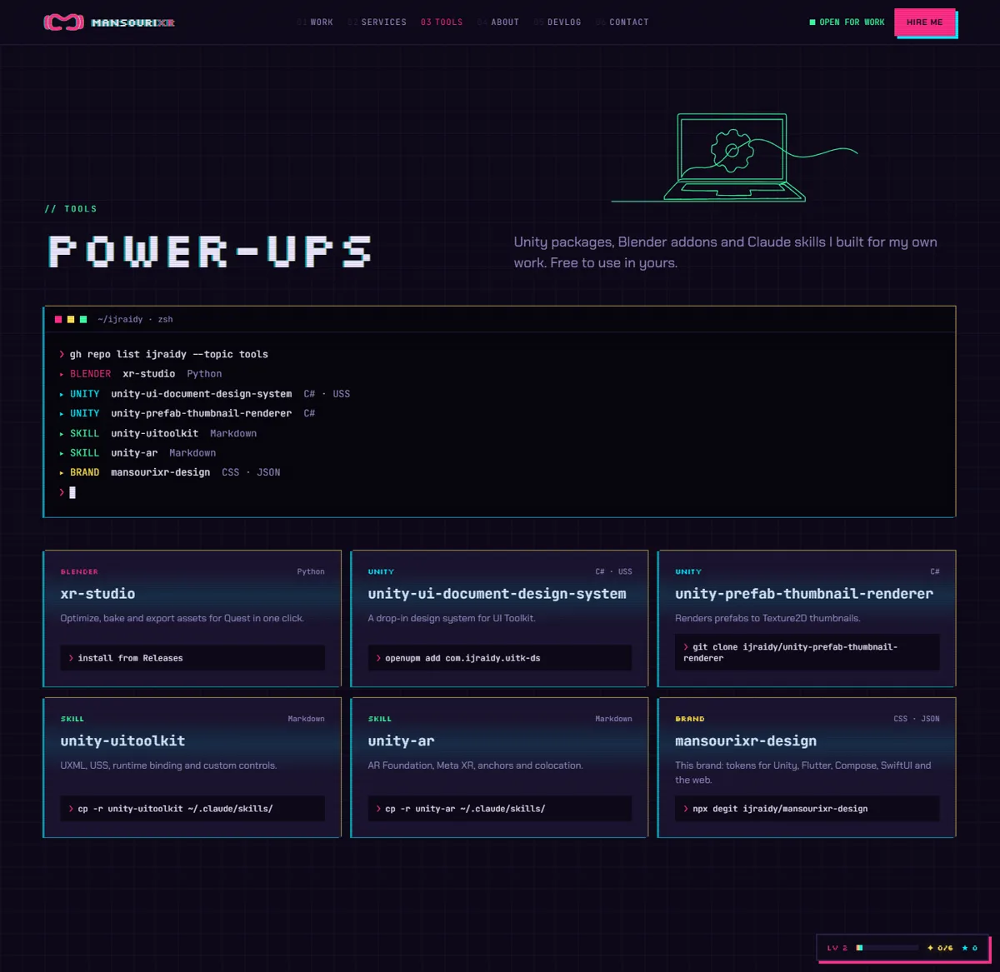
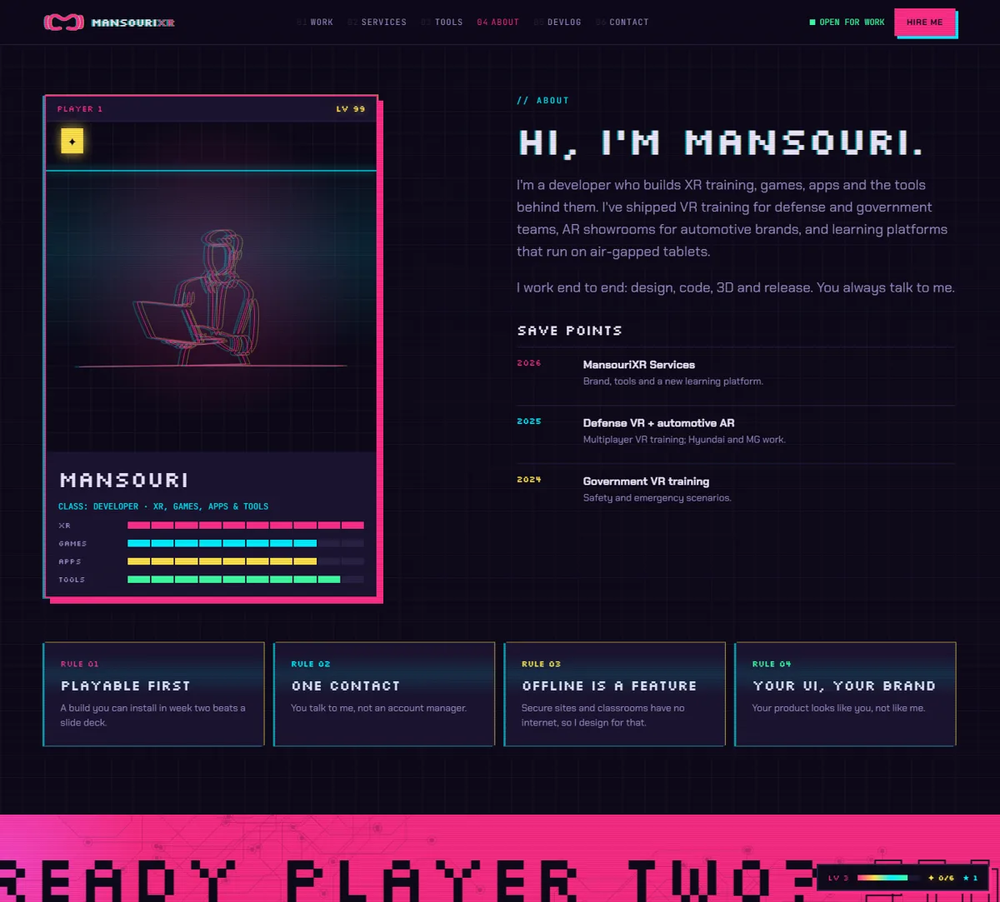

  
  <h1>Juraydi al-Mansouri</h1>
  
<strong>I build worlds you play, wear and use.</strong>

  
XR developer. Unity 6, Meta Quest, Flutter, Three.js and the web. VR training for defense and government teams, AR for car brands, games, apps and the tools behind them. One developer, pitch to headset.

<!-- status -->

  
  
  
  

<!-- stack -->

  
  
  
  
  
  
  
  
  
  
  
  

<!-- links -->

  
  
  
  

  <a href="https://mansouri.uk/work">Work</a> ·
  <a href="https://mansouri.uk/services">Services</a> ·
  <a href="https://mansouri.uk/tools">Tools</a> ·
  <a href="https://mansouri.uk/about">About</a> ·
  <a href="https://mansouri.uk/devlog">Devlog</a> ·
  <a href="https://mansouri.uk/contact">Contact</a>

> [!IMPORTANT]
> Most of my code is client work under NDA, so the repositories on this account are private. The case studies live on [mansouri.uk/work](https://mansouri.uk/work) with real captures, and I am happy to walk through any codebase on a call. Public releases go out through `*-releases` repositories with checksums.

## Contents

- [What I build](#what-i-build)
- [Selected work](#selected-work)
- [Tools I made](#tools-i-made)
- [How I work](#how-i-work)
- [Stack](#stack)
- [Timeline](#timeline)
- [GitHub](#github)
- [Contact](#contact)

## What I build

| | World | What ships | Stack |
|---|---|---|---|
| 🥽 | **XR / VR / AR** | VR training, AR showrooms and mixed reality. Single-player or multiplayer, online or air-gapped. | Unity 6, Meta XR, AR Foundation, Pico |
| 🎮 | **Games** | Arcade, quiz, projection-mapped and serious games that feel good to play. | Unity, JS Canvas, Netcode |
| 📱 | **Apps** | Mobile, tablet, desktop and web apps, shipped to Google Play and the App Store. | Flutter, Kotlin, Swift, Next.js |
| 🧰 | **Tools** | Unity packages, Blender addons, CLIs and AI agent skills for other builders. | C#, Python, TypeScript |

## Selected work

Every project below is a case study on the site with the problem, what I built and the result.

| | Project | Kind | Stack | Status | Result |
|---|---|---|---|---|---|
| 🥽 | [VR Tactical Trainer](https://mansouri.uk/work/defense-vr) | XR · VR | Unity 6 · Quest 3 · Netcode | In service | Multiplayer scenarios, instructor console and replay, used in every debrief |
| 🚗 | [Hyundai AR Showroom](https://mansouri.uk/work/hyundai-ar) | XR · AR | Unity · ARCore / ARKit | Live | True-scale cars in your driveway, on campaign and showroom tablets |
| 🥊 | [Wallbrawl](https://mansouri.uk/work/wallbrawl) | Game | JS · Canvas · Projector | v0.4 · playable | Any wall becomes a two-player arena in 30 seconds |
| 🏎️ | [MG 3D Configurator](https://mansouri.uk/work/mg-config) | App · 3D | Three.js · Web | Live | Real-time 3D that runs smoothly on mid-range Android phones |
| 🧊 | [XR-Studio](https://mansouri.uk/work/xrstudio) | Tool | Python · Blender 4.2 | v1.2 | One-click decimation, baking, LODs and a Quest export preset |
| 📚 | [Ma'qil Learn](https://mansouri.uk/work/maqil) | App · AR | Unity 6 · Android tablets | Pilot | Offline-first lesson player with 14 phases, AR, XP and badges, synced to an air-gapped LMS |
| 🛡️ | [Gov Safety VR](https://mansouri.uk/work/gov-vr) | XR · VR | Unity · Quest · Pico | In service | Bilingual emergency-procedure training with automatic certificates |
| 🖼️ | [AR Art Studio](https://mansouri.uk/work/arart) | App · AR | Flutter · Three.js | Beta | A printed artwork becomes AR from one project JSON |
| 🧩 | [ALC Quiz Arena](https://mansouri.uk/work/quiz) | Game | Unity · Multiplayer | Live | Phone buzzers, live scoreboard and a host screen for training days |
| 📡 | [Presentation Sync](https://mansouri.uk/work/sync) | App | Flutter · Kotlin | In use | One tablet mirrors PDF, ink and screen to eight over closed Wi-Fi |
| 🧠 | [MansouriXR Studio](https://mansouri.uk/work/mxr-studio) | AI · Tool | TypeScript · Electron | In development | An Arabic-first, right-to-left AI coding studio |

Also on the account, private for now

| Project | What it is | Stack |
|---|---|---|
| Minuteman | Local-first meeting assistant for Windows and iPhone, signed installers in [minuteman-releases](https://github.com/ijraidy/minuteman-releases) | Rust, Swift |
| Ma'qil Command | Air-gapped LMS: self-registration, placement, entitlements, launch tokens, analytics, certificates | Express, Postgres, Next.js, Docker |
| Flightline | Unity tablet home that lists a learner's books and opens the player with a signed launch token | Unity 6, C# |
| QR Inventory | QR inventory management for Android | Unity, C# |
| LRC Project | Static training hub with level-gated tests and a 4,249-word vocabulary trainer | HTML, JS |
| Home Lab | Command center for self-hosted AR/VR, game and app development workflows | Python |

## Tools I made

| | Tool | For | What it does |
|---|---|---|---|
| 🧊 | **xr-studio** | Blender | Optimize, bake and export assets for Quest in one click. Used on every XR project I ship. |
| 🎨 | **mansourixr-design** | Unity, Flutter, Compose, SwiftUI, web | One brand as tokens for every stack. The site and the app read the same source. |
| 🤖 | **unity-uitoolkit** | AI coding agents | UXML, USS, runtime binding and custom controls with current APIs. |
| 🤖 | **unity-ar** | AI coding agents | AR Foundation, Meta XR, anchors and colocation patterns and fixes. |

## How I work

| Step | | What happens |
|---|---|---|
| 1 | **Call** | 30 minutes. You explain it, I ask the hard questions. |
| 2 | **Prototype** | A playable build in 1 to 2 weeks, on your device. |
| 3 | **Build** | Weekly builds you can install and test. |
| 4 | **Ship** | Store or headset release, handoff docs and support. |

- **Playable first.** A build you can install in week two beats a slide deck.
- **One contact.** You talk to the person who writes the code.
- **Offline is a feature.** Secure sites and classrooms have no internet, so I design for that: local sync servers, signed launch tokens, air-gapped deploys.
- **Your UI, your brand.** Your product looks like you, not like me.
- **Arabic as standard.** Right-to-left UI, Arabic voice-over and bilingual content on every GCC project.

## Stack

  

| Layer | Tools |
|---|---|
| Headsets and devices | Meta Quest 2, 3 and Pro, Pico, Apple Vision Pro, Android and iOS phones and tablets, desktop, web |
| Engines and 3D | Unity 6, Meta XR SDK, AR Foundation, Netcode, Unreal, Godot, Three.js, Blender 4.2 |
| Apps | Flutter and Dart, Kotlin, Swift, React, Next.js, TypeScript, Electron |
| Backend and infra | Express, Postgres, Docker, Cloudflare Workers, local sync servers for air-gapped sites |
| Systems and tooling | Rust, Python, C#, PowerShell, signed release pipelines with checksums |
| Design | Figma, one design system with tokens for every stack, Excalidraw for every diagram |

## Timeline

| Year | Chapter | What shipped |
|---|---|---|
| 2026 | MansouriXR | Brand, site, mobile app, tools, an Arabic-first AI coding studio and a new offline learning platform |
| 2025 | Defense VR and automotive AR | Multiplayer VR tactical training; Hyundai AR showroom and MG 3D configurator |
| 2024 | Government VR training | Safety and emergency scenarios, bilingual, with certificates |

## GitHub

  
  
  
  

Almost all of those contributions land in private repositories, so the contribution graph on this profile shows only the public slice. Every project ships with a README to the same standard: badges, real captures, a docs index, a roadmap with a Gantt, a bug tracker, CI on every push and signed, checksummed releases. Ask for a walkthrough of any of them.

## Contact

| | |
|---|---|
| 🌐 | [mansouri.uk](https://mansouri.uk) |
| ✉️ | [hello@mansouri.uk](mailto:hello@mansouri.uk) |
| 📱 | [app.mansouri.uk](https://app.mansouri.uk), the MansouriXR app for Android and iOS |
| 🎮 | Press Start on the site, find the six coins, and open the contact page to earn the Player 2 achievement |

Every capture on this page is the real site, taken on 2026-09-24.

