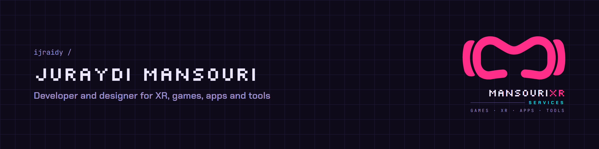

<picture>
  <source media="(prefers-color-scheme: dark)" srcset=".github/brand/banner-dark.png">
  <source media="(prefers-color-scheme: light)" srcset=".github/brand/banner-light.png">
  
</picture>

# J.Mansouri

Developer and designer building XR, games, apps and tools.

**MansouriXR Services** is a side-hustle product label for independent apps and experiments. 

## Focus

| Area | What I build |
|---|---|
| XR and AR | Training tools, mixed-reality prototypes, AR learning flows |
| Games | Unity projects, classroom games, interaction systems |
| Apps | Flutter, desktop, mobile and local-first tools |
| Systems | Self-hosted workflows, dashboards, automation and release pipelines |

## Selected Work

| Project | Type | Link |
|---|---|---|
| MansouriXR | Brand, website and app | [ijraidy/mansourixr-](https://github.com/ijraidy/mansourixr-) |
| MansouriXR Studio | Design engine and design-system workspace | [ijraidy/mansourixr-studio](https://github.com/ijraidy/mansourixr-studio) |
| Minuteman | Local-first meeting assistant | [ijraidy/MinuteMan](https://github.com/ijraidy/MinuteMan) |
| AR Art Studio | Printed artwork to AR workflow | [ijraidy/ar-art-studio](https://github.com/ijraidy/ar-art-studio) |
| QR Asset Registry | Unity Android inventory app | [ijraidy/qr-inventory-management](https://github.com/ijraidy/qr-inventory-management) |
| ALC Quiz Arena | Classroom quiz system | [ijraidy/ALC_QUIZ_Arena](https://github.com/ijraidy/ALC_QUIZ_Arena) |

## Stack

  
  
  
  
  
  
  

## Contact

- GitHub: [github.com/ijraidy](https://github.com/ijraidy)
- Website: [mansouri.uk](https://mansouri.uk)

---

   
  <b>DEVELOPED BY JURAYDI MANSOURI</b> 
  MansouriXR Services · GAMES · XR · APPS · TOOLS

